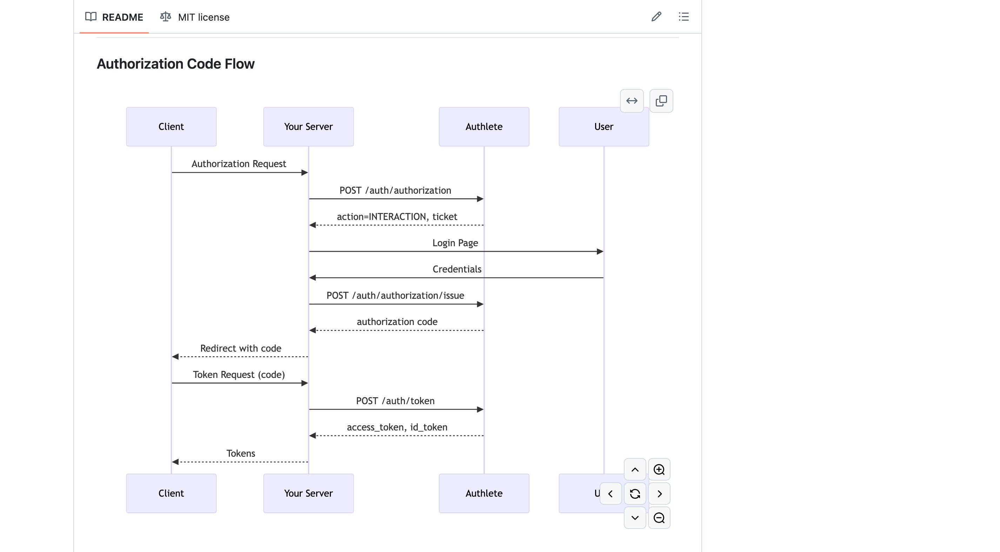
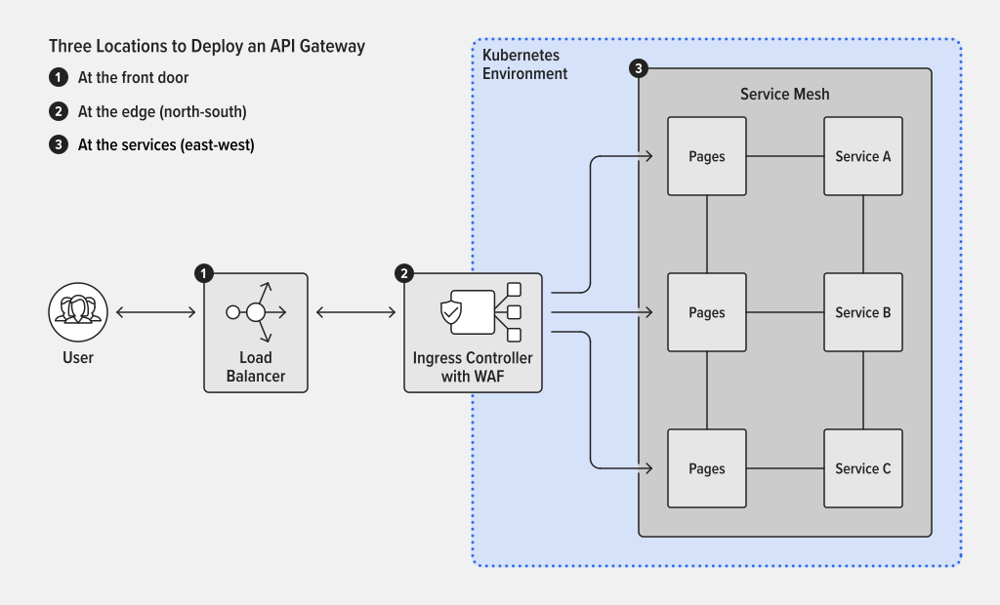

# authlete
The authorization server only issues access tokens, it does not authenticate the user.

updated the openapi spec from the authlete doc and changed 
```yml
supportedClientRegistrationTypes:
 type: array
 items:
  $ref: '#/components/schemas/Client/properties/clientRegistrationTypes/items'
```            
to `$ref: '#/components/schemas/ClientRegistrationType'`

also changed `            $ref: '#/components/schemas/Client/properties/clientRegistrationTypes/items'` 
```yml
clientRegistrationTypes:
type: array
items:
    type: string
    description: |
    Values for the `client_registration_types` RP metadata and the
    `client_registration_types_supported` OP metadata that are defined in
    [OpenID Connect Federation 1.0](https://openid.net/specs/openid-connect-federation-1_0.html).
    enum:
    - AUTOMATIC
    - EXPLICIT
description: |
    The client registration types that the client has declared it may use.
 ```           

    

Got the working spec from below
[openapi](https://github.com/authlete/openapi)

# Authlete API 3.0.16
Authlete is an API-first authorization and authentication platform that enables you to build OAuth 2.0 and OpenID Connect servers, as well as verifiable credential issuers.

## API Overview

The Authlete API is organized into two main categories:

### Management APIs
Configure and manage your authorization infrastructure:
- **Services**: Create and configure authorization servers
- **Clients**: Register and manage OAuth 2.0/OIDC client applications
- **Policies**: Define authorization policies and access control rules

### Runtime APIs
Implement OAuth 2.0 and OpenID Connect flows:
- **Authorization**: Handle authorization requests and consent
- **Token**: Issue and manage access tokens, refresh tokens, and ID tokens
- **Introspection & Revocation**: Validate and revoke tokens
- **UserInfo**: Serve user information endpoints
- **Dynamic Client Registration**: Support RFC 7591 client registration

## Authentication

All Authlete API endpoints require Bearer token authentication. You must include your access token in the `Authorization` header of every request:

```http
Authorization: Bearer YOUR_ACCESS_TOKEN
```

### Token Types

Authlete supports two types of access tokens:

#### Service Access Token
Scoped to a **single service** (authorization server instance).

**Use when:**
- Automating service-level configuration
- Building authorization server runtime endpoints
- Managing clients within a specific service

**How to get one:**
1. Log in to the [Authlete Console](https://console.authlete.com)
2. Navigate to your service
3. Go to **Settings** → **Access Tokens**
4. Click **Create Token**
5. Select appropriate permissions (e.g., `service.read`, `client.write`)
6. Copy the generated token

#### Organization Token
Scoped to your **entire organization** with permissions across all services.

**Use when:**
- Managing multiple services programmatically
- Performing org-wide automation
- Building control plane tooling

**How to get one:**
1. Log in to the [Authlete Console](https://console.authlete.com)
2. Navigate to **Organization Settings**
3. Go to **Access Tokens**
4. Click **Create Token**
5. Select organization-level permissions
6. Copy the generated token

### Testing Your Token

Verify your token works with a simple API call:

```bash
curl -X GET https://api.authlete.com/api/service/get/list \
  -H "Authorization: Bearer YOUR_ACCESS_TOKEN"
```

A successful response confirms your token is valid and has the correct permissions.

## Base URLs

Authlete operates globally with regional API clusters. Choose the region that best meets your data residency requirements:

| Region | Base URL |
|--------|----------|
| 🇺🇸 United States | `https://us.authlete.com` |
| 🇯🇵 Japan | `https://jp.authlete.com` |
| 🇪🇺 Europe | `https://eu.authlete.com` |
| 🇧🇷 Brazil | `https://br.authlete.com` |

Replace `https://api.authlete.com` in examples with your regional base URL.

## Quick Start

### 1. Get Your Access Token

Follow the steps in the [Authentication](#authentication) section to create a Service or Organization token.

### 2. Make Your First API Call

List your services:

```bash
curl -X GET https://us.authlete.com/api/service/get/list \
  -H "Authorization: Bearer YOUR_ACCESS_TOKEN" \
  -H "Content-Type: application/json"
```

### 3. Create a Client Application

Register a new OAuth 2.0 client:

```bash
curl -X POST https://us.authlete.com/api/{serviceId}/client/create \
  -H "Authorization: Bearer YOUR_ACCESS_TOKEN" \
  -H "Content-Type: application/json" \
  -d '{
    "clientName": "My Application",
    "redirectUris": ["https://myapp.example.com/callback"],
    "grantTypes": ["AUTHORIZATION_CODE", "REFRESH_TOKEN"],
    "responseTypes": ["CODE"]
  }'
```

### 4. Process an Authorization Request

When your authorization server receives an authorization request, forward it to Authlete:

```bash
curl -X POST https://us.authlete.com/api/{serviceId}/auth/authorization \
  -H "Authorization: Bearer YOUR_ACCESS_TOKEN" \
  -H "Content-Type: application/json" \
  -d '{
    "parameters": "response_type=code&client_id=CLIENT_ID&redirect_uri=https://myapp.example.com/callback&scope=openid profile"
  }'
```

Authlete validates the request and returns an action for your authorization server to take.

## API Patterns

### Request/Response Flow

Most Authlete APIs follow this pattern:

1. **Your server receives a request** from a client application
2. **Forward to Authlete** with request parameters
3. **Authlete validates** and returns an `action` field
4. **Your server responds** to the client based on the action

Example response structure:

```json
{
  "resultCode": "A004001",
  "resultMessage": "[A004001] The authorization request is valid.",
  "action": "INTERACTION",
  "ticket": "TICKET_VALUE",
  "client": {
    "clientId": 1234567890,
    "clientName": "My Application"
  }
}
```

### Action-Based Responses

The `action` field tells you what to do next:

- **`OK`**: Success - return the provided `responseContent` to the client
- **`INTERACTION`**: User authentication required - show login page
- **`NO_INTERACTION`**: Issue token immediately (e.g., refresh token grant)
- **`BAD_REQUEST`**: Invalid request - return 400 error with `responseContent`
- **`UNAUTHORIZED`**: Authentication failed - return 401 error
- **`INTERNAL_SERVER_ERROR`**: Server error - return 500 error

### Tickets

Many Authlete APIs use **tickets** as correlation identifiers:

1. Initial API call returns a `ticket`
2. After completing your processing (e.g., user authentication), call a follow-up API with the ticket
3. Authlete uses the ticket to retrieve the original context

Example flow:
```
/auth/authorization → returns ticket → [user authenticates] → /auth/authorization/issue (with ticket)
```

## Common Workflows

### Authorization Code Flow

### Token Introspection

```bash
curl -X POST https://us.authlete.com/api/{serviceId}/auth/introspection \
  -H "Authorization: Bearer YOUR_ACCESS_TOKEN" \
  -H "Content-Type: application/json" \
  -d '{
    "token": "ACCESS_TOKEN_TO_VALIDATE"
  }'
```

Response indicates if the token is active and includes metadata:

```json
{
  "action": "OK",
  "active": true,
  "clientId": 1234567890,
  "subject": "user123",
  "scopes": ["openid", "profile"],
  "expiresAt": 1699999999000
}
```

## Error Handling

All Authlete API responses include:

- **`resultCode`**: Machine-readable error code (e.g., `A004201`)
- **`resultMessage`**: Human-readable error description
- **`action`**: Recommended action to take

Example error response:

```json
{
  "resultCode": "A001202",
  "resultMessage": "[A001202] Authorization header is missing.",
  "action": "INTERNAL_SERVER_ERROR"
}
```

### Common Error Codes

| Code | Meaning |
|------|---------|
| `A001201` | TLS required - use HTTPS |
| `A001202` | Missing Authorization header |
| `A001203` | Invalid access token |
| `A001215` | Client is locked |
| `A004101` | Invalid authorization request parameters |

`Request Model → Domain → Domain Logic → Domain → Response Model`

```sh
HTTP JSON Request
      ↓
 models.requests.CreateUserRequest
      ↓ (validation, mapping)
 domain.User
      ↓ (services, business logic)
 domain.User
      ↓ (mapping)
 models.responses.UserResponse
      ↓
HTTP JSON Response
```

Convert models → domain for input, and domain → models for output.

this is where we can make use of `Chimney`


This authorization server implementation uses Authlete as its backend.
What this means are (1) that the core part of the implementation of OAuth
2.0 and OpenID Connect is not in the source tree of java-oauth-server
but in the Authlete server on cloud, and (2) that authorization data such as
access tokens, settings of the authorization server itself and settings of
client applications are not stored in any local database but in the database
on cloud. Therefore, to put it very simply, this implementation is just an
intermediary between client applications and Authlete server as illustrated
below.

```
+--------+          +-------------------+          +----------+
|        |          |                   |          |          |
| Client | <------> | scala-oauth-server | <------> | Authlete |
|        |          |                   |          |          |
+--------+          +-------------------+          +----------+
```

However, because Authlete focuses on **authorization** and does NOT do
anything about end-user **authentication**, functions related to
authentication are implemented in the source tree of java-oauth-server.
Authlete provides Web APIs that can be used to write an authorization
server

### Authorization Endpoint

  1. `boolean isUserAuthenticated()`
  2. `long getUserAuthenticatedAt()`
  3. `String getUserSubject()`
  4. `String getAcr()`
  5. `Response generateAuthorizationPage(AuthorizationResponse)`

The most important method among the above is
`generateAuthorizationPage()` The method is called to
generate an authorization page. In contrast, the other methods are not so
important because they are called only when an authorization request comes
with a special request parameter `prompt=none`. If you have no mind to
support `prompt=none`, you can leave your implementations of the methods
empty. Details about `prompt=none` is written in
`3.1.2.1. Authorization Request` of `OpenID Connect Core 1.0`


### Authorization Page


As mentioned, `generateAuthorizationPage()` is a method to generate an authorization page.Retrieve the data from the
argument (an intance of `AuthorizationResponse` class which
represents a response from Authlete's `/api/auth/authorization` API) and
embeds them into an HTML template, `authorization.jsp`

### Internationalization

For the internationalization of the authorization page, you may take
`ui_locales` parameter into consideration which may be contained in an
authorization request. It is a new request parameter defined in `OpenID Connect Core 1.0`. The following is the description about the parameter
excerpted from the specification.

> OPTIONAL. End-User's preferred languages and scripts for the user interface,
> represented as a space-separated list of BCP47 [RFC5646] language tag values,
> ordered by preference. For instance, the value "fr-CA fr en" represents a
> preference for French as spoken in Canada, then French (without a region
> designation), followed by English (without a region designation). An error
> SHOULD NOT result if some or all of the requested locales are not supported
> by the OpenID Provider.

You can get the value of `ui_locales` request paremeter as a `String` array
by calling `getUiLocales()` method of `AuthorizationResponse` instance. Note
that, however, you have to explicitly specify which UI locales to support
using the management console ([Service Owner Console][13]) because
`getUiLocales()` method returns only supported UI locales. In other words,
it is ensured that the array returned by `getUiLocales()` never contains
unsupported UI locales whatever `ui_locales` request parameter contains.


#### Display type

An authorization request may contain `display` request parameter to specify
how to display the authorization page. It is a new request parameter defined
in `OpenID Connect Core 1.0`. The predefined values of the request
parameter are as follows. The descriptions in the table are excerpts from
the specification.

| Value | Description |
|:------|:------------|
| page  | The Authorization Server SHOULD display the authentication and consent UI consistent with a full User Agent page view. If the display parameter is not specified, this is the default display mode. |
| popup | The Authorization Server SHOULD display the authentication and consent UI consistent with a popup User Agent window. The popup User Agent window should be of an appropriate size for a login-focused dialog and should not obscure the entire window that it is popping up over. |
| touch | The Authorization Server SHOULD display the authentication and consent UI consistent with a device that leverages a touch interface. |
| wap   | The Authorization Server SHOULD display the authentication and consent UI consistent with a "feature phone" type display. |

You can get the value of `display` request parameter as an instance of
`Display` enum by calling `getDisplay()` method of
`AuthorizationResponse` instance. By default, all the display types are
checked as supported in the management console (`Service Owner Console`),
but you can uncheck them to declare some values are not supported. If an
unsupported value is specified as the value of `display` request parameter,
it will result in returning an `invalid_request` error to the client
application that made the authorization request.

### Authorization Decision Endpoint
In an authorization page, an end-user decides either to grant permissions to
the client application which made the authorization request or to deny the
authorization request. An authorization server must be able to receive the
decision and return a proper response to the client application according to
the decision.

The server receives the end-user's
decision at `/api/authorization/decision`. 

  1. `boolean isClientAuthorized()`
  2. `long getUserAuthenticatedAt()`
  3. `String getUserSubject()`
  4. `String getAcr()`
  5. `getUserClaim(String claimName, String languageTag)`


### End-User Authentication

Authlete does not care about how to authenticate an end-user at all.
Instead, Authlete requires the subject of the authenticated end-user.
`_Subject_` is a technical term in the area related to identity and it means
a unique identifier. In a typical case, subjects of end-users are values of
the primary key column or another unique column in a user database.

When an end-user grants permissions to a client application, you have
to let Authlete know the subject of the end-user. "if `isClientAuthorized()` returns `true`, then `getUserSubject()`
must return the subject of the end-user."_

For end-user authentication, server has `UserDao` class and
`UserEntity` class. These two classes compose a dummy user database.
Of course, you have to replace them with your own implementation to
refer to your actual user database.

### Token Endpoint
The current definition of the interface has only one method named `authenticateUser`.
This method is used to authenticate an end-user. However, the method is called
only when the grant type of a token request is [Resource Owner Password
Credentials]. Therefore, if you have no mind to support the grant type,
you can leave your implementation of the method empty.

### Introspection Endpoint

[RFC 7662][35] (OAuth 2.0 Token Introspection) requires that the endpoint
be protected in some way or other. 


The difference between a Web Application Firewall (WAF) and an API Gateway comes down to their primary focus: the WAF is a security specialist, while the API Gateway is a traffic manager and general security enforcer

An API Gateway is a traffic and policy enforcement layer that acts as a single point of entry for all API requests.

- A client sends a request.
- The WAF inspects the request for malicious code (e.g., SQL injection). If it's malicious, it's blocked.
- The request passes to the API Gateway, which checks the JWT/API Key, enforces rate limits, and routes it to the correct microservice


### API Gateway for Kubernetes

Containers are the most efficient way to run microservices, and Kubernetes is the de facto standard for deploying and managing containerized applications and workloads.
    

### API Gateway and Ingress Gateway or Ingress Controller

Ingress gateways and Ingress controllers are tools that implement the Ingress object, a part of the Kubernetes Ingress API, to expose applications running in Kubernetes to external clients. They manage communications between users and applications (user-to-service or north-south connectivity). However, the Ingress object by itself is very limited in its capabilities. For example, it does not support defining the security policies attached to it. As a result, many vendors create custom resource definitions (CRDs) to expand their Ingress controller’s capabilities and satisfy evolving customer needs and requirements, including use of the Ingress controller as an API gateway

### API Gateway Is Not the Same as Gateway API

While their names are similar, an API gateway is not the same as the Kubernetes Gateway API. The Kubernetes Gateway API is an open source project managed by the Kubernetes community to improve and standardize service networking in Kubernetes. The Gateway API specification evolved from the Kubernetes Ingress API to solve various challenges around deploying Ingress resources to expose Kubernetes apps in production, including the ability to define fine-grained policies for request processing and delegate control over configuration across multiple teams and roles.

### Service Mesh vs API Gateway

A service mesh is an infrastructure layer that controls communications across services in a Kubernetes cluster (service-to-service or east-west connectivity). The service mesh delivers core capabilities for services running in Kubernetes, including load balancing, authentication, authorization, access control, encryption, observability, and advanced patterns for managing connectivity (circuit braker, A/B testing, and blue-green and canary deployments), to ensure that communication is fast, reliable, and secure.

Deployed closer to the apps and services, a service mesh can be used as a lightweight, yet comprehensive, distributed API gateway for service-to-service communications in Kubernetes.


## Load Balancing

```conf
upstream f1-api{
    server 10.1.1.4:8001
    server 10.1.1.4:8002
    sticky cookie srv_id expires=1h path=/ domain=example.com
}

```
name of cookie is `srv_id`
A cookie is created and sent with the response and the client sends the cookie every time it makes a request
Each request is routed to the server which initially served the request

So apparently, the load balancing algorithms still apply but only for the first request,subsequent requests rely on the cookie


Each request routed to this endpoint is verified against the local `.jwk`
```conf
localtion=/api/f1/circuits{
    auth_jwt on;
    auth_jwt_key_file /etc/nginx/api_secret_jwt
proxy_pass http://f1-1api
}
```
Format a specific directory:
`scala-cli fmt src`

Check formatting without modifying files (“CI mode”): `scala-cli fmt --check .`
