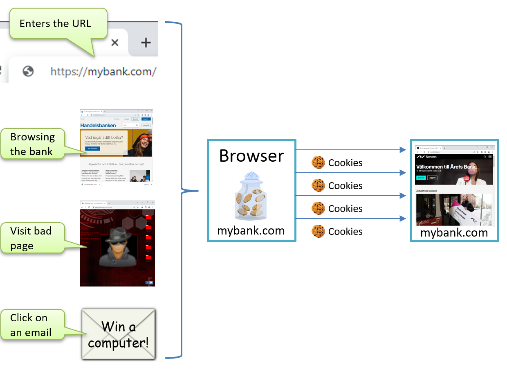

## WHY FAPI

1. OAuth 2.1 is a general purpose profile, and does not enforce the higher security options
2. It is not an interoperability profile.OAuth 2 gives you a lot of options( different grant types,different types of authentication,different cryptographic algorithms etc).it also adds extensions like pkce for added security

All of this gives you options,but if you want to create a large ecosystem, you don't want options, you want interoperability.. So you have to select some of these options, but `which options`??
3. Also you quickly realized you would want more features than OAuth alone can give you especially in large ecosystems
For example, asking for a complex consent
Say you want to authorize a bank transfer, so you need to ask the user that they should give their permission to transfer a certain amount of money from some bank account to another bank account
How do you do this in OAuth? there is no mechanism by default

How do you manage existing grants? so say you already got permission from the user to read maybe one of their mailboxes, now you want to read another of their email mail boxes govern by the same authorization server..how do you do that?

4. And there is the problem of non-reprodiation

All of these are very common problems but OAuth 2 doesn't give you the tools to address these

OAuth 2 gives you authorization, openid connect gives you authentication and confirmance tests.. OAuth 2.1 gives you security plus authorization, but says nothing about authentication and gives no confirmance tests and none of these things gives you the interoerability part

That is where FAPI comes into play
from financial api=>financial api security profile=>financial grade api security profile

`fapi-2-0-security-profile`: Standard FAPI 2.0 requirements (PAR, Private Key JWT, etc.).

`fapi-2-0-message-signing`: Adds JARM (signed responses) requirements.

```json
{
  "name": "FAPI-2.0-Enforcement-Policy",
  "description": "Enforces FAPI 2.0 Security Profile for high-security clients",
  "enabled": true,
  "conditions": [
    {
      "condition": "client-roles",
      "providers": {
        "roles": [ "fapi-client" ]
      }
    }
  ],
  "profiles": [
    "fapi-2-0-security-profile"
  ]
}
```

The OpenID Foundation created a "Baseline" profile for most high-security needs and a "Second" profile for extreme-risk scenarios (like moving millions of dollars).

FAPI 2.0 Security Profile (The "Standard")
This is what 95% of high-security apps (Open Banking, Fintech) use. It focuses on Sender Constraining.

FAPI 2.0 Message Signing (The "Extra Secure")
This is an additional layer added on top of the Security Profile. It focuses on Non-Repudiation

Prove exactly what the user and the server agreed to, so neither side can lie about it later.

It uses JARM (JWT Secured Authorization Response Mode). Every single message sent between the app and Keycloak is digitally signed.


[FAPI 2.0: A High-Security Profile for OAuth and OpenID Connect](https://dl.gi.de/server/api/core/bitstreams/19a83b7e-d0bb-4483-a474-2ef6984ceef3/content)

A growing number of APIs, from the financial, health and other sectors, give access to highly sensitive data and resources. With the Financial-grade API (FAPI) Security Profile, the OpenID Foundation has created an interoperable and secure standard to protect such APIs.

Multi-banking apps and other fintech offerings usually need to access their users’ bank accounts in order to retrieve account information and initiate payments. For many years, screen-scaping has been the norm in this area: Apps use their users’ online banking credentials to access (directly or via a server) the bank’s online banking website through an
emulated browser and extract relevant information

A token-based approach to delegation of authorization, such as the one offered by OAuth 2.0 , can ensure that users can give apps and services access to their resources in a controlled and secure way.For open banking use cases such as the one described before, it is, however, not sufficient to just prescribe the use of OAuth 2.0: The IETF standard only defines a framework for protocols but leaves a wide range of options in almost all areas of the communication. For a practical use in any larger ecosystem, a profile of OAuth 2.0 needs to be defined to ensure interoperability between participants in the ecosystem, to ensure an andequate level of security, and to define a common feature set

### FAPI 1.0 and FAPI 2.0: Overview
FAPI was created by the OpenID Foundation’s FAPI working group in order to address the following challenges:
- `Security`: In financial applications, a high level of security must be guaranteed. On its own and without applying further restrictions, OAuth 2.0 is not suitable for high-security applications, as it provides several options that are only secure under moderately strong attacker models. FAPI ensures that specific options are selected and extensions are applied which ensure that the resulting protocol is suitable for high-security applications
- `Interoperability`: FAPI standardizes the protocol features that are used by clients and servers in order to ensure an interoperability between all participants in an ecosystem. This comprises standard OAuth 2.0 features from RFC6749 and RFC6750 as well as extensions, such as client authentication via mutual TLS (RFC8705).
- `Common feature set`: FAPI further ensures that protocol features are available that solve commonly encountered problems in financial ecosystems, for example, the
transfer of complex and fine-grained information on the authorization requested by the client. This prevents the creation of individual solutions that lack standardization and support by software vendors.

Through a number of measures, all FAPI profiles achieve a higher level of security than plain OAuth 2.0 can offer

First of all, less-secure protocol options are forbidden. The prime example is the `OAuth Implicit Grant`, where an access token is transferred through the user’s web browser

As another example, redirect URIs in FAPI must be HTTPS URIs and have to be pre-registered with the authorization server, preventing common vulnerabilities with OAuth redirections

Finally, a major difference to many existing OAuth deployments is also that symmetric client secrets are disallowed in all FAPI profiles except for FAPI 1.0 Baseline.

The second security measure in FAPI is the mandatory use of a selected set of extensions improving the security of OAuth, such as Proof Key for Code Exchange (PKCE) which protects authorization codes from misuse

Additionally, some of the security measures in FAPI 1.0 are based on existing OpenID Connect features, necessitating the use of OpenID Connect even if authentication or the transfer of end-user information is not desired and OAuth alone would be sufficient. This can create additional complexity for developers. Another goal for FAPI 2.0 is therefore to make OpenID Connect a fully optional part of the specification and ensuring security with native OAuth features and extensions

ey security features were tied to OIDC messages:

- State Integrity: Developers used the OIDC `id_token` as a detached signature to verify that the authorization response hadn't been tampered with (using the `c_hash` or `s_hash` claims).code hash and state hash
- Non-Repudiation: The `id_token` provided a signed statement of the transaction that OAuth 2.0 alone couldn't natively provide.

FAPI 2.0 moves these security requirements back into the OAuth layer by utilizing modern extensions that didn't exist or weren't mature when 1.0 was written.
- `Pushed Authorization Requests (PAR)`: By moving the authorization parameters from the front-channel (the browser URL) to a secure back-channel call, the need for complex request object signing (JAR) or OIDC-based integrity checks is significantly reduced.

- `JARM (JWT Secured Authorization Response Mode)`: This is the "killer feature" for FAPI 2.0. It allows the authorization server to wrap the response in a standard JWT. This provides the same signature protection as an OIDC `id_token` but works for any OAuth flow, even without OIDC.

- `DPoP and MTLS`: High-security sender-constraining is handled at the transport or application level (OAuth), making it independent of whether the token carries identity information.


### The Problem: The "Detached Signature"
In FAPI 1.0, the biggest security risk was Response Substitution or Injection Attacks. Because standard OAuth 2.0 returns codes and state via the browser URL (the "front-channel"), an attacker could potentially swap a legitimate authorization code for a malicious one.

To prevent this, FAPI 1.0 forced developers to use OpenID Connect because OIDC returns an `id_token` which contains a `c_hash` (code hash). The client would:
- Receive the code and the `id_token`.
- Hash the code manually.
Compare it to the `c_hash` in the signed `id_token`. If they matched, the client knew the code hadn't been tampered with. This required OIDC libraries even if you didn't care about user identity.
 
### The Solution: JARM (The OAuth-Native Way)

JARM simplifies this by taking the entire authorization response (the code, state, etc.) and wrapping it in a single JSON Web Token (JWT).
How it works:
- The Request: The client sends an authorization request with a specific parameter: `response_mode=jwt`.
- The Response: Instead of a URL like ?`code=xyz&state=abc`, the server sends a single JWT: `?response=eyJhbGci....`
- The Validation: The client simply verifies the signature of that one JWT.

In FAPI 1.0 Advanced, the most common setup was using the OIDC Hybrid Flow, which utilized response_type=code id_token.

PAR (Pushed Authorization Requests)
Instead of sending a massive, signed request through the user's browser (which is public and easily intercepted), the client "pushes" the request directly to the server in a secure back-channel call. The server gives the client a simple request_uri to use in the browser.
As we discussed, the server then sends the code back inside a JWT.

The best way to think about it is: OIDC uses the OAuth 2.0 "handshake" to deliver a specific piece of data—the identity of the user.

### The "Black Box" of Authentication
In standard OAuth 2.0, the "Authentication" part is a black box.
- The App sends the user to the Bank (Authorization Server).
- The Bank asks for a password, a fingerprint, or a hardware key.
- The App has no idea how it happened.

Once the user is done, the Bank just sends back a code. The App knows it got a code, but it doesn't actually receive any proof of who logged in, when they logged in, or how strong their password was

In OAuth 2.0: Authentication is a "Means to an End"

OIDC says: “Let’s use OAuth to authorize access to an identity assertion.”
That identity assertion is the ID Token.

FAPI 2.0 Baseline and Advanced use the same attacker model, i.e., both must ensure the security and integrity of the authorization (and possibly, authentication) process in the presence of attackers with the described capabilities

For Advanced, additional non-repudiation goals are defined: it must be ensured that receivers of protocol messages can prove the origin and integrity of all relevant messages received

FAPI 1.0 used OIDC to get these signatures. FAPI 2.0 achieves this goal using purely OAuth-native or specialized signing extensions.
`The Request Side: Pushed Authorization Requests (PAR)`
To ensure the origin and integrity of the request:
In the Security Profile, you just use a secure back-channel (PAR).

In the Advanced/Signing profile, the client signs the PAR request itself (using JAR—JWT Secured Authorization Request). This proves the client specifically requested "$5,000 to Account X."

`The Response Side: JARM (JWT Secured Authorization Response Mode)`
To ensure the origin and integrity of the response:
The Authorization Server signs the response JWT.

integrity: Usually via a Hash. The sender creates a "digital fingerprint" of the message.
- Integrity by itself doesn't tell you who sent the message.
`Non-repudiation` is a legal and accountability concept. It builds on integrity but adds Proof of Origin. It ensures that the sender cannot later claim, "I didn't send that transaction," or "That wasn't me."

Non-repudiation works via Digital Signatures (asymmetric cryptography). The sender signs the message with their private key.

FAPI 2.0 Security Profile (Baseline) focuses heavily on Integrity. It uses secure channels (like PAR) to make sure codes aren't swapped.

FAPI 2.0 Message Signing (Advanced) adds Non-Repudiation. It requires every request to be signed by the client. This is vital for "high-value" actions where the bank needs a permanent, undeniable record of what the client requested.

Non-repudiation requires a private/public key pair.

Integrity is handled via a MAC (Message Authentication Code). Both the Sender and the Receiver have the same secret key.

Process: Sender combines the message + secret key to create a hash. Receiver does the same and compares.
The Flaw in Non-Repudiation: If a dispute happens, the Sender can say, "I didn't send that! You have the secret key too, so you could have generated that hash yourself to frame me!"

`Non-Repudiation `
This is what FAPI 2.0 Advanced requires. It uses Digital Signatures (like RS256 or ES256).
Process: The Sender uses their Private Key (which they never share) to sign the message. The Receiver uses the Sender's Public Key to verify it.

The Strength: Because the Receiver does not have the Private Key, they could not have created the signature themselves. If the signature is valid, it must have come from the Sender.

Integrity->Hash(Message+Key)	
Non-Repudiation->Sign(Message,PrivateKey)

The two heavyweights in FAPI 2.0 are PS256 and ES256.
PS256 is the high-security evolution of the classic RSA algorithm.
Standard RSA signing (RS256) is deterministic. If you sign the same message twice, you get the same signature
ES256 uses Elliptic Curve Cryptography (specifically the P-256 curve).

Hashing is the process of taking any amount of data and turning it into a fixed-size string of characters (the "digest" or "fingerprint").

`Authentication = cryptographic proof that the data was created by someone who knows a specific secret or private key`


`HMAC(key, message)`
- Only someone with the shared secret key can generate a valid MAC
- Verifier must also know the secret

MAC (Message Authentication Code)
A MAC is a "Tag" attached to a message to prove that the sender knows a specific secret.

HMAC is a specific, highly secure way of building a MAC using a hashing algorithm (like SHA-256).
It hashes the message and the secret key together in a specific nested way (`HMAC=Hash(Key+Hash(Key+Message))`).
Very common in standard API security (like AWS signatures).

Hash-based message authentication code (or HMAC) is a cryptographic authentication technique that uses a hash function and a secret key.

Key Components (Non-repudiation)
- Proof of Origin
Confirms the identity of the sender. The sender cannot later deny sending a specific message or performing a specific action.
- Proof of Delivery/Receipt
Confirms that the intended recipient received the information. The recipient cannot claim they never got it.
- Integrity Protection
Ensures that the message or transaction has not been altered during transmission. If tampering occurs, it can be detected.

 Blockchain transactions use hashing to ensure integrity and proof of action.

 HMAC can confirm the authenticity of a message. Because the hash is generated with a secret key, a correctly computed HMAC assures the recipient that the message came from a source possessing the correct shared secret key and therefore is authentic. This double-check of both integrity and authenticity provides a high level of security for data transmission.

 This provides strong integrity and symmetric-key authentication for data transmission.

Authentication = proof of possession of a secret (or private key) that only authorized parties should have.

It is called authentication in this context because the code acts as a proof of origin. In the security world, we call this Data Origin Authentication

Data origin authentication is a process used to verify the source of data to ensure that it comes from a legitimate and trusted origin. It is crucial for establishing trust and integrity in digital communications and transactions

One of the main information security objectives is to provide assurance about the original source of a received message. This goal is usually referred to as data origin authentication, and it is a stronger version of another cryptographic goal, the so-called data integrity. The latter addresses the unauthorized (including accidental) alteration of the message, from the time it was created, transmitted or stored by an authorized user. Data origin authentication, on the other hand, provides assurance of the identity of the sender of the message, in addition to data integrity

Another security objective that is closely related to data origin authentication, is the so-called non-repudiation, which prevents the original sender of a specific message from denying to a third party his/her action. This is a stronger requirement than data origin authentication, because the latter provides this assurance to the receiver of the message, but it does not provide any evidence that could be presented to a third party in order, for example, to resolve a dispute between the sender and the receiver

In modern cryptography, data origin authentication is provided by message-authentication codes(MACs), which require the two legitimate users (sender and receiver) to share a common secret key. Typically, MACs are built from block ciphers or hash functions

On the other hand, digital signature schemes are the main mechanism for providing non-repudiation and they typically rely on public-key cryptography. Both MACs and digital-signature schemes offer data origin authentication, but only the latter can ensure non-repudiation. Hence, digital-signature schemes are of vital importance in cases where the sender and the receiver of the message do not
trust each other (e.g., business applications), and there is the potential of dispute over the message.

Message authentication or data origin authentication is an information security property that indicates that a message has not been modified while in transit (data integrity) and that the receiving party can verify the source of the message

There are three primary technical paths to achieve this, ranging from basic protection to high-level legal non-repudiation

- Message Authentication Code (MAC / HMAC)
- Digital Signatures
- Authenticated Encryption (AEAD)
Modern cryptography often combines encryption (confidentiality) and authentication into a single step called AEAD (Authenticated Encryption with Associated Data)

In TLS Handshake
The signature proves the server owns the private key
CA only vouches for public key → domain binding
Signature proves key possession, not identity
TLS spec explicitly calls this:
Proof of possession of the private key

## Proof of possession of the private key
- Proof of Possession (PoP) of a private key is
a cryptographic method proving you hold a private key without revealing it, typically done by signing a challenge with the private key to generate a digital signature, which a verifier checks against the public key, preventing stolen tokens from being misused, especially through OAuth 2.0 extensions like DPoP (Demonstrating Proof-of-Possession)

- PKI and SSL/TLS: When requesting an SSL certificate, a Certificate Authority (CA) often requires a Certificate Signing Request (CSR) as proof that you own the private key for the domain you are trying to secure.

- Blockchain & Crypto Wallets: Every cryptocurrency transaction is essentially a proof of possession. Signing a transaction with a private key proves ownership of the funds associated with a public address.

A certificate signing request (CSR) is a message sent to a certificate authority to request the signing of a public key and associated information. Most commonly a CSR will be in a PKCS10 format. The contents of a CSR comprises a public key, as well as a common name, organization, city, state, country, and e-mail. Not all of these fields are required and will vary depending with the assurance level of your certificate. Together these fields make up the Certificate Signing Request (CSR). 

The CSR is signed by the applicant's private key; this proves to the CA that the applicant has control of the private key that corresponds to the public key included in the CSR

```sh
# Certificate Signing Request (CSR) 
-----BEGIN CERTIFICATE REQUEST-----

-----END CERTIFICATE REQUEST-----
```

```sh
openssl req -new -key key.pem -sha256 -out request.csr
```
In this case, if your key is `RSA`, the algorithm will be `sha256WithRSAEncryption`.

### Generate a private key
```sh
# RSA (2048-bit)
openssl genpkey -algorithm RSA -pkeyopt rsa_keygen_bits:2048 -out rsa.key

# EC (recommended: P-256)

openssl genpkey -algorithm EC -pkeyopt ec_paramgen_curve:P-256 -out ec.key

# Create a Certificate Signing Request (CSR)
openssl req -new -key ec.key -out request.csr \
  -subj "/C=US/ST=CA/L=SF/O=ExampleCorp/CN=example.com"

## Self-sign a certificate (test / internal use)
openssl x509 -req -in request.csr -signkey ec.key -days 365 -out cert.pem
```

### Create a CA (Certificate Authority)

```sh
# CA private key
openssl genpkey -algorithm RSA -pkeyopt rsa_keygen_bits:4096 -out ca.key

# CA certificate

openssl req -x509 -new -key ca.key -days 3650 -out ca.pem \
  -subj "/C=US/O=MyCA/CN=My Root CA"

## Sign a certificate with the CA
openssl x509 -req -in request.csr \
  -CA ca.pem -CAkey ca.key -CAcreateserial \
  -days 365 -out signed-cert.pem
```

###  Sign a file with a certificate (digital signature)

```sh
# Create signature
openssl dgst -sha256 -sign ec.key -out file.sig message.txt

# Verify signature using certificate

openssl dgst -sha256 -verify <(openssl x509 -in cert.pem -pubkey -noout) \
  -signature file.sig message.txt

```

`javax.security.cert` is deprecated use, `java.security.cert`

```sh
Certificate  ::=  SEQUENCE  {
    tbsCertificate       TBSCertificate,
    signatureAlgorithm   AlgorithmIdentifier,
    signature            BIT STRING  }
 ```

 CAs are services which create certificates by placing data in the X.509 standard format and then digitally signing that data. CAs act as trusted third parties, making introductions between principals who have no direct knowledge of each other. CA certificates are either signed by themselves, or by some other
CA such as a "root" CA.

The ASN.1 definition of tbsCertificate is:
```sh
 TBSCertificate  ::=  SEQUENCE  {
     version         [0]  EXPLICIT Version DEFAULT v1,
     serialNumber         CertificateSerialNumber,
     signature            AlgorithmIdentifier,
     issuer               Name,
     validity             Validity,
     subject              Name,
     subjectPublicKeyInfo SubjectPublicKeyInfo,
     issuerUniqueID  [1]  IMPLICIT UniqueIdentifier OPTIONAL,
                          -- If present, version must be v2 or v3
     subjectUniqueID [2]  IMPLICIT UniqueIdentifier OPTIONAL,
                          -- If present, version must be v2 or v3
     extensions      [3]  EXPLICIT Extensions OPTIONAL
                          -- If present, version must be v3
     }
 ```    
 Certificates are instantiated using a certificate factory. The following is an example of how to instantiate an X.509 certificate:

 ```java
  try (InputStream inStream = new FileInputStream("fileName-of-cert")) {
     CertificateFactory cf = CertificateFactory.getInstance("X.509");
      X509Certificate cert = (X509Certificate)cf.generateCertificate(inStream);
 }
 ```
```sh
Public Key Info
Algorithm
Elliptic Curve
Key Size
256
Public Value : value here
```

The key usage extension defines the purpose (e.g., encipherment,
 signature, certificate signing) of the key contained in the
 certificate.
 The ASN.1 definition for this is:
 ```sh
 KeyUsage ::= BIT STRING {
     digitalSignature        (0),
     nonRepudiation          (1),
     keyEncipherment         (2),
     dataEncipherment        (3),
     keyAgreement            (4),
     keyCertSign             (5),
     cRLSign                 (6),
     encipherOnly            (7),
     decipherOnly            (8) 
     }
 ```
 RFC 5280 recommends that when used, this be marked
 as a critical extension.

 By restricting the key's application, it helps mitigate security risks—for example, preventing a key intended only for signing from being used for encryption.

 keyEncipherment (2)
This is used when the public key is intended for encrypting other keys. A classic example is RSA in TLS, where the client encrypts a symmetric "pre-master secret" using the server's public key and sends it to the server.

keyCertSign (5)
This is a high-privilege bit. It allows the key to be used to verify signatures on other certificates. This bit must be set in Certificate Authority (CA) certificates; if it is not set, the certificate cannot act as a CA to issue other certs


```sh
openssl s_client -connect google.com:443 -showcerts </dev/null 2>/dev/null | openssl x509 -text -noout | grep -A 1 "Key Usage"

   X509v3 Key Usage: critical
                Digital Signature
            X509v3 Extended Key Usage: 
                TLS Web Server Authentication
```                
CA: Digital Signature, Certificate Signing, CRL Signing


use   `java.security.Security.getProviders()` to get a list of providers
```sh
Provider: SUN, version: 21
Provider: SunRsaSign, version: 21
Provider: SunEC, version: 21
Provider: SunJSSE, version: 21
Provider: SunJCE, version: 21
Provider: SunJGSS, version: 21
Provider: SunSASL, version: 21
Provider: XMLDSig, version: 21
Provider: SunPCSC, version: 21
Provider: JdkLDAP, version: 21
Provider: JdkSASL, version: 21
Provider: Apple, version: 21
Provider: SunPKCS11, version: 21
```

The Most Common Alternative: Bouncy Castle

```Security.addProvider(new BouncyCastleProvider());```

SunPKCS11: This is the bridge to Hardware Security Modules (HSMs) or Smart Cards. It follows the PKCS#11 standard to perform crypto operations on physical hardware without the private key ever leaving the device.

SunRsaSign: If your certificate uses RSA (e.g., keyEncipherment), this provider performs the actual modular exponentiation math.

SunEC: If your certificate uses ECC (Elliptic Curve), this provider handles the point multiplication for ECDSA signatures or ECDH key agreement.

SunJCE: Handles the symmetric encryption (like AES) once the keys have been exchanged.

`Security.insertProviderAt(new BouncyCastleProvider(), 1);`

The math for RSA is split across providers:
- SunRsaSign: Handles RSA Signatures (Identity).
- SunJCE: Handles RSA Ciphers (Encryption/Privacy).

A PKCS #10 certificate request is created and sent to a Certificate
Authority, which then creates an X.509 certificate and returns it to
the entity that requested it. A certificate request basically consists
of the subject's X.500 name, public key, and optionally some attributes,
signed using the corresponding private key.
 
The ASN.1 syntax for a Certification Request is:
```sh
  CertificationRequest ::= SEQUENCE {
     certificationRequestInfo CertificationRequestInfo,
     signatureAlgorithm       SignatureAlgorithmIdentifier,
     signature                Signature
   }
 
  SignatureAlgorithmIdentifier ::= AlgorithmIdentifier
  Signature ::= BIT STRING
 
  CertificationRequestInfo ::= SEQUENCE {
     version                 Version,
     subject                 Name,
     subjectPublicKeyInfo    SubjectPublicKeyInfo,
     attributes [0] IMPLICIT Attributes
  }
  Attributes ::= SET OF Attribute
  ```

Access tokens that are sender-constrained via DPoP stand in contrast to the typical bearer token, which can be used by any client in possession of the access token

DPoP introduces the concept of a DPoP Proof, which is a JWT created by the client and sent as a header in an HTTP request. A client uses a DPoP proof to prove the possession of a private key corresponding to a certain public key.

When the client initiates an access token request, it attaches a DPoP proof to the request in an HTTP header. The authorization server binds (sender-constrains) the access token to the public key associated in the DPoP proof

When the client initiates a protected resource request, it again attaches a DPoP proof to the request in an HTTP header


The resource server obtains information about the public key bound to the access token, either directly in the access token (JWT) or via the token introspection endpoint. The resource server then verifies that the public key bound to the access token matches the public key in the DPoP proof. It also verifies that the access token hash in the DPoP proof matches the access token in the request.

DPoP Access Token Request

To request an access token that is bound to a public key using DPoP, the client MUST provide a valid DPoP proof in the DPoP header when making an access token request to the authorization server token endpoint. This is applicable for all access token requests regardless of authorization grant type (e.g. `authorization_code`, `refresh_token`, `client_credentials`, etc).

The following HTTP request shows an `authorization_code` access token request with a DPoP proof in the `DPoP` header:

```sh
POST /oauth2/token HTTP/1.1
Host: server.example.com
Content-Type: application/x-www-form-urlencoded
DPoP: eyJraWQiOiJyc2EtandrLWtpZCIsInR5cCI6ImRwb3Arand0IiwiYWxnIjoiUlMyNTYiLCJqd2siOnsia3R5IjoiUlNBIiwiZSI6IkFRQUIiLCJraWQiOiJyc2EtandrLWtpZCIsIm4iOiIzRmxxSnI1VFJza0lRSWdkRTNEZDdEOWxib1dkY1RVVDhhLWZKUjdNQXZRbTdYWE5vWWttM3Y3TVFMMU5ZdER2TDJsOENBbmMwV2RTVElOVTZJUnZjNUtxbzJRNGNzTlg5U0hPbUVmem9ST2pRcWFoRWN2ZTFqQlhsdW9DWGRZdVlweDRfMXRmUmdHNmlpNFVoeGg2aUk4cU5NSlFYLWZMZnFoYmZZZnhCUVZSUHl3QmtBYklQNHgxRUFzYkM2RlNObWtoQ3hpTU5xRWd4YUlwWThDMmtKZEpfWklWLVdXNG5vRGR6cEtxSGN3bUI4RnNydW1sVllfRE5WdlVTRElpcGlxOVBiUDRIOTlUWE4xbzc0Nm9SYU5hMDdycTFob0NnTVNTeS04NVNhZ0NveGxteUUtRC1vZjlTc01ZOE9sOXQwcmR6cG9iQnVoeUpfbzVkZnZqS3cifX0.eyJodG0iOiJQT1NUIiwiaHR1IjoiaHR0cHM6Ly9zZXJ2ZXIuZXhhbXBsZS5jb20vb2F1dGgyL3Rva2VuIiwiaWF0IjoxNzQ2ODA2MzA1LCJqdGkiOiI0YjIzNDBkMi1hOTFmLTQwYTUtYmFhOS1kZDRlNWRlYWM4NjcifQ.wq8gJ_G6vpiEinfaY3WhereqCCLoeJOG8tnWBBAzRWx9F1KU5yAAWq-ZVCk_k07-h6DIqz2wgv6y9dVbNpRYwNwDUeik9qLRsC60M8YW7EFVyI3n_NpujLwzZeub_nDYMVnyn4ii0NaZrYHtoGXOlswQfS_-ET-jpC0XWm5nBZsCdUEXjOYtwaACC6Js-pyNwKmSLp5SKIk11jZUR5xIIopaQy521y9qJHhGRwzj8DQGsP7wMZ98UFL0E--1c-hh4rTy8PMeWCqRHdwjj_ry_eTe0DJFcxxYQdeL7-0_0CIO4Ayx5WHEpcUOIzBRoN32RsNpDZc-5slDNj9ku004DA

grant_type=authorization_code\
&client_id=s6BhdRkqt\
&code=SplxlOBeZQQYbYS6WxSbIA\
&redirect_uri=https%3A%2F%2Fclient%2Eexample%2Ecom%2Fcb\
&code_verifier=bEaL42izcC-o-xBk0K2vuJ6U-y1p9r_wW2dFWIWgjz-
```

The following shows a representation of the DPoP Proof JWT header and claims:

```json
{
  "typ": "dpop+jwt",
  "alg": "RS256",
  "jwk": {
    "kty": "RSA",
    "e": "AQAB",
    "n": "3FlqJr5TRskIQIgdE3Dd7D9lboWdcTUT8a-fJR7MAvQm7XXNoYkm3v7MQL1NYtDvL2l8CAnc0WdSTINU6IRvc5Kqo2Q4csNX9SHOmEfzoROjQqahEcve1jBXluoCXdYuYpx4_1tfRgG6ii4Uhxh6iI8qNMJQX-fLfqhbfYfxBQVRPywBkAbIP4x1EAsbC6FSNmkhCxiMNqEgxaIpY8C2kJdJ_ZIV-WW4noDdzpKqHcwmB8FsrumlVY_DNVvUSDIipiq9PbP4H99TXN1o746oRaNa07rq1hoCgMSSy-85SagCoxlmyE-D-of9SsMY8Ol9t0rdzpobBuhyJ_o5dfvjKw"
  }
}
```
```json
{
  "htm": "POST",
  "htu": "https://server.example.com/oauth2/token",
  "iat": 1746806305,
  "jti": "4b2340d2-a91f-40a5-baa9-dd4e5deac867"
}
```

After the authorization server successfully validates the DPoP proof, the public key from the DPoP proof will be bound (sender-constrained) to the issued access token.

The following access token response shows the `token_type` parameter as `DPoP` to signal to the client that the access token was bound to its DPoP proof public key:

```http
HTTP/1.1 200 OK
Content-Type: application/json
Cache-Control: no-store

{
 "access_token": "Kz~8mXK1EalYznwH-LC-1fBAo.4Ljp~zsPE_NeO.gxU",
 "token_type": "DPoP",
 "expires_in": 2677
}
```

Traditionally, OAuth authorization requests contain all information in the parameters of a single URL to which the user’s browser is redirected. The information that is transferred includes the kind of access the client requests (expressed as a list of strings in the scope parameter) and various security-related parameters. This approach bears three problems:First, the data is neither encrypted nor integrity protected, i.e., the user or malicious code running in the user’s browser can read and/or modify the scope or security-critical parameters. Second, there is an upper limit to the length of the data, imposed by the maximum length of a URL. And finally, a list of strings is not expressive enough for complex use cases. For example, a client may want to acquire authorization to initiate a payment of a certain amount of money to a specific bank account using a defined reference text. Custom encodings can be
used to circumvent this limit, but these are non-standard and often lack support by software
vendors


To solve these problems, two OAuth extensions where created in the IETF and have become part of FAPI 2.0:
- Pushed Authorization Requests (PAR) give the client an option to send all data that is normally contained in the authorization request to a special PAR endpoint at the authorization server, using a POST request. Since the data is transferred via a direct, authenticated channel between the client and the authorization server, integrity and confidentiality of all parameters can be ensured. The client receives a unique identifier in response, which can be used in place of the original parameters in the authorization request.
- Rich Authorization Requests (RAR) are enabled through a new authorization request parameter, authorization_details, with a pre-defined, extensible structure. It can be used to transfer complex authorization requirements. While the precise contents of the parameter depend on the ecosysteme or scheme it is used in, its fixed structure enables easier software vendor support.Due to its benefits for security, PAR must be used in FAPI 2.0. RAR is to be used when the
scope parameter is not sufficient to solve the use case at hand


### Rationale for Choosing OIDC Federation as Profile Foundation

This document proposes adopting the OpenID Connect (OIDC) Federation model as the underlying framework for the UAE's Registration Profile. This approach aims to streamline the data access journey, enabling Authorized Data Receivers (e.g., Fintechs Onboarded into the Trust Framework) to interact with Data Providers without the need for a pre-registration step.

OIDC Federation addresses and resolves the interoperability challenges observed in other open finance ecosystems, such as Open Finance Brazil and Open Banking UK, which rely on OAuth Dynamic Client Registration (DCR) RFC7591.

[Formal Security Analysis of the OpenID FAPI 2.0 Family of Protocols: Accompanying a Standardization Process](https://dl.acm.org/doi/epdf/10.1145/3699716)


## Same Site
Before SameSite protection existed, browsers had a dangerous default behavior where they would send cookies with every request to your domain, regardless of where that request originated. This meant malicious websites could trigger requests to your application and your users’ cookies would be automatically included



This creates a serious vulnerability. Imagine a user is logged into their banking application in one tab, then clicks a malicious link in an email. That malicious site can send hidden requests to the bank’s website, and because the browser automatically includes the user’s session cookie, the bank sees these requests as legitimate. This is the foundation of Cross-Site Request Forgery (CSRF) attacks.

The SameSite attribute solves this problem by giving you control over when cookies are included in cross-site requests
- Strict
The cookie is only sent with requests originating from the same site. This provides maximum protection but can impact user experience. Users clicking links from external sites (emails, social media) will appear logged out and need to sign in again
- Lax (default)
The cookie is sent for “safe” top-level navigation (like clicking a link) but blocked for potentially dangerous requests (like form submissions from other sites). This prevents most CSRF attacks while maintaining good usability

- None
The cookie is sent with all cross-site requests. This requires the Secure flag and should only be used if your application specifically needs cross-site cookie access. This is how cookies behaved before the SameSite attribute was introduced


All of these domains are considered part of the same site:
- example.com
- login.example.com
- api.example.com
- test.login.example.com

The Subdomain Takeover Risk
This broad cookie scope creates a vulnerability: if an attacker compromises any subdomain (such as test.api.example.com), they can potentially access cookies intended for your main application. This is known as a subdomain takeover attack. 
The Solution: `__Host-` Prefixed Cookie Names

Fortunately, modern browsers provide a powerful solution: prefixed cookie names. The `__Host-` prefix enables the strongest origin-binding protection available, transforming your cookie from site-scoped to origin-scoped security.
Here’s how it works: when a cookie name starts with `__Host-`, browsers automatically activate special security restrictions.

`Set-Cookie: __Host-SessionCookie=XXXXX; HttpOnly; Secure; Path=/; SameSite=Strict`

Requirements for __Host- cookies:

- No Domain attribute – This locks the cookie to the exact hostname that set it
- Path must be / – Ensures the cookie applies to the entire origin
- Must include Secure flag – Enforces HTTPS-only transmission

With the `__Host-` prefix, a cookie set by https://example.com becomes completely isolated. It will never be sent to:

- login.example.com
- api.example.com
- test.login.example.com

This simple naming convention eliminates the risk of subdomain takeover entirely. Your session cookie is now bound to the exact origin that created it, not just the broader site boundary.

By default, if you don't specify a domain, the browser treats it as a Host-Only cookie.

To be considered `Same-Origin`, the scheme (protocol), host, and port must match exactly. To be `Same-Site`, only the TLD+1 (the top-level domain and the name just before it) needs to match

Both `shop.example.com` and `blog.example.com` are same-site but different origins

The Same-Origin Policy is much stricter. A script running on `blog.example.com` cannot normally reach into the DOM of `shop.example.com` to read data because they are different origins

If you want to fetch data from one subdomain to another via JavaScript, you still have to deal with CORS (Cross-Origin Resource Sharing)


In OpenID Connect, the state parameter serves as an opaque value created by the client. Its primary function is maintaining the state between the initial request and the callback, acting as a shield against cross-site request forgery attacks during the authentication process.

While some implementations keep the state as a random value, that is verified during the callback. Other implementations injecting “data” into the state parameter. By doing this, the client doesn’t have to remember this information elsewhere, making the client stateless.